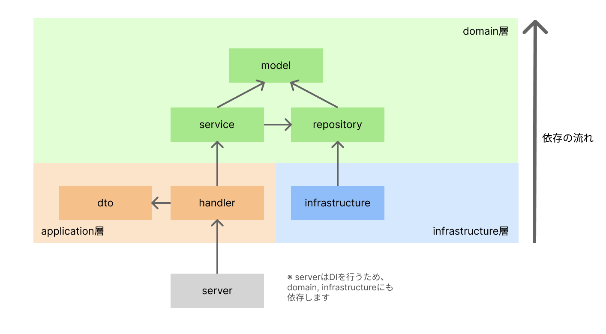

# アーキテクチャ

https://qiita.com/hmarf/items/7f4d39c48775c205b99b#domain

ここを参考に、オニオンアーキテクチャ風のレイヤードアーキテクチャでサンプルを実装してみました。

## ディレクトリ構成
```
internal
├─ application
│  ├─ handler
│  ├─ requset
│  └─ response
│
├─ domain
│  ├─ model
│  ├─ repository
│  └─ service
│
├─ infrastructure
└─ server
```

`domain/model`を頂点にして依存の流れを一方行にしています。



## 各パッケージの説明
各層のパッケージの責務について

###  application層
#### handler
- リクエストのパース、バリデーション
- サービス層の呼び出し
- レスポンスのハンドリング

#### response
- レスポンスの生成

#### request
- リクエストの定義（構造体、バリデーションの設定など）

### domain層
#### model
- ドメインモデルの定義
- 何にも依存しない

#### repository
- 永続化層のインターフェースの定義
- 実体は`infrastructure`で定義する（依存関係を逆転させるための役割）

#### service
- ビジネスロジックの実装

### infrastructure層
- 永続化層
- DBなどの外部リソースとのやりとりを記載
- `domain/repository`で定義したインターフェースの実体を実装する

### server
- DBセットアップ
- DI
- ルーティングセットアップ